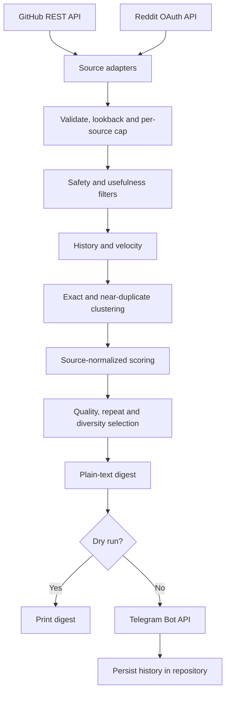

# LLM Prompt Radar

A standard-library Python notifier that discovers public prompts with source evidence, filters unsafe or low-value entries, ranks candidates, and sends up to five by Telegram. It sends fewer when too few meet the quality floor. The scheduled workflow runs daily at **01:00 UTC (10:00 Asia/Tokyo)**.

## Architecture and data flow



Each adapter can fail independently. Network calls use a 25-second timeout and retry transient network errors, HTTP 429, and 5xx responses up to three attempts with bounded backoff. A Retry-After above 30 seconds is reported and skipped to keep a daily run bounded. Authentication and other 4xx errors are not retried. Logs are JSON lines with source names, counts, scores, and error types; raw prompt text and credentials are not logged.

## Sources and access

| Source | Interface | Limits |
| --- | --- | --- |
| GitHub | Official REST API repository search and README endpoint | Public repositories, stars, README prompt extraction. Uses the Actions `GITHUB_TOKEN`. No code search. |
| Reddit | Official OAuth Data API search in selected prompt communities | Optional; requires an authorized OAuth app, `REDDIT_CLIENT_ID`, `REDDIT_CLIENT_SECRET`, and the `REDDIT_USERNAME` Actions variable for the required identifying User-Agent. No unauthenticated scraping fallback. |
| PromptBase / FlowGPT | Not currently accessed | No documented public API/feed verified for this project. No scraping or access-control bypass. |

The `SourceAdapter` interface isolates sources. New sources should use a documented API, RSS/feed, or clearly permitted structured public interface. If one source fails, the run continues with the others and reports the failure. Lookback filtering uses candidate publication time; for GitHub this is repository last-updated time because an exact prompt publication date is generally unavailable.

## Ranking and quality rules

Default composite weights are engagement 30%, trend 25%, positive feedback 20%, recency 15%, and usefulness 10%. Configured weights are normalized to sum to one. Engagement and velocity are ranked within each source after `ln(1 + metric)` transformation, then multiplied by a log-volume factor: `min(1, ln(1+x)/ln(101))` for engagement and `min(1, ln(1+x)/ln(11))` for trend. This avoids comparing Reddit votes directly with GitHub stars.

- **Engagement:** GitHub stars; Reddit post score plus twice comment count.
- **Trend:** change in interactions per hour from history, when available. On a first sighting, interactions are divided by item age. The fallback is labeled in the digest; it cannot detect a burst before a second observation.
- **Positive feedback:** 95% Wilson lower confidence bound, with `z=1.96`: `(p + z^2/(2n) - z*sqrt((p*(1-p)+z^2/(4n))/n)) / (1+z^2/n)`. Missing rating evidence uses neutral 0.5 and is not presented as a measured rating.
- **Recency:** `exp(-age_days / 45)`.
- **Usefulness:** deterministic 0-1 heuristic for structure, examples, constraints/checklists, practical domain cues, and prompt length. It is not an LLM assessment.
- **Confidence:** descriptive volume label (High at 500+, Medium at 80+, otherwise Low); it is not a probability.

The minimum composite score defaults to `0.48`. The selector does not lower it to reach the requested count. It allows no more than the configured total or per-source cap; it prefers at most two prompts per category, with a third only at score 0.85+. Suspicious Reddit engagement receives a 75% penalty to engagement/trend and Low confidence. Popularity is not treated as proof of quality.

Deterministic filters reject recognized credential/private-key/password patterns, likely email/phone/national-ID strings, jailbreak or safety-bypass language, common affiliate/engagement-bait phrases, generic role-only prompts, and weak prompt-list SEO signals. These pattern checks cannot recognize every sensitive or malicious item. Review the original source before using a prompt. No discovered content is executed or treated as application instructions.

## Deduplication and history

Prompt text is normalized to lowercase alphanumeric tokens with common filler removed. Exact normalized text gets a stable SHA-256 ID. Near-copies are joined when the higher of token-sequence similarity and adjusted shared-token containment similarity reaches `RADAR_DEDUP_THRESHOLD` (default `0.78`). This is heuristic rather than embedding-based; substantially different paraphrases can pass, and short unrelated text can collide. Cross-source copies are shown as sightings, not independent validation.

`history.json` stores accepted prompt hashes, normalized text, cluster IDs, source, URLs, author, discovery/publication dates, category/model, engagement/rating data, scores, notification dates, and engagement observations. Observations last 90 days; unnotified records last 365 days. Notification clusters remain to suppress repeats. A prompt may resurface after seven days only with a substantial interaction increase, at least 3x its prior observed rate, and current score at least 0.85. History is saved only after Telegram accepts a normal digest. Dry runs and test messages do not modify history.

## Configuration

Set optional values as repository **Actions variables** unless marked as a secret. Invalid values fall back to the stated default or are bounded to the documented range.

| Name | Default | Meaning |
| --- | --- | --- |
| `RADAR_MAX_PROMPTS` | `5` | Maximum digest size, 1-10. |
| `RADAR_MIN_SCORE` | `0.48` | Minimum composite score, 0-1. |
| `RADAR_WEIGHTS` | `{"engagement":0.3,"trending":0.25,"positive":0.2,"recency":0.15,"usefulness":0.1}` | JSON object for the five score components; nonnegative values are normalized to sum to 1. |
| `RADAR_SOURCES` | `github,reddit` | Enabled adapters, comma-separated. Valid names: `github`, `reddit`. |
| `RADAR_LOOKBACK_DAYS` | `7` | Candidate age cutoff, 1-365 days. Uses GitHub repository update date as a proxy. |
| `RADAR_MAX_PER_SOURCE` | `3` | Candidate cap per source, 1-25, applied before global ranking. |
| `RADAR_DEDUP_THRESHOLD` | `0.78` | Similarity threshold, 0-1; higher means stricter matching/fewer merges. |
| `DRY_RUN` | `false` | When true, discover/rank/render and print, but do not send or save history. The manual workflow has a dry-run checkbox. |
| Workflow `schedule.cron` | `0 1 * * *` | Daily schedule in UTC; currently 10:00 in Japan. Edit the radar workflow to change it. |
| `TELEGRAM_BOT_TOKEN` (secret) | required to send | Telegram bot token. Existing repository secret can be reused. |
| `TELEGRAM_CHAT_ID` (secret) | required to send | Default Telegram destination. |
| `RADAR_TELEGRAM_CHAT_ID` (secret) | unset | Optional destination override. |
| `REDDIT_CLIENT_ID` (secret) | unset | Optional Reddit OAuth app ID. |
| `REDDIT_CLIENT_SECRET` (secret) | unset | Optional Reddit OAuth app secret. |
| `REDDIT_USERNAME` (Actions variable) | unset | Reddit account name, optionally with a leading `u/`; used in Reddit's required descriptive User-Agent. |
| `GITHUB_TOKEN` | Actions token | Supplied automatically by GitHub Actions; not a manually configured key. |
| LLM provider/model | none | No LLM is called; all analysis is deterministic. |

## Setup and running

1. In **Repository Settings → Secrets and variables → Actions**, ensure `TELEGRAM_BOT_TOKEN` and `TELEGRAM_CHAT_ID` exist. Optionally set `RADAR_TELEGRAM_CHAT_ID` to direct this notifier elsewhere.
2. To enable Reddit, register an OAuth app at [Reddit's app settings](https://www.reddit.com/prefs/apps) using Reddit's documented process. Reddit's Help page points developers to that self-service registration, and its Data API requires a registered OAuth token; access can be limited by Reddit policy. Store the app's client ID and secret as the repository Actions secrets `REDDIT_CLIENT_ID` and `REDDIT_CLIENT_SECRET`, and add your Reddit account name as the Actions variable `REDDIT_USERNAME`. Never paste the client secret into chat or commit it. If Reddit does not grant the app API access, leave the adapter skipped; the radar continues to use GitHub.
3. To test Telegram alone, use **Actions → LLM Prompt Radar → Run workflow** and select **Send a Telegram test message**. It does not query sources or touch history.
4. To preview a real discovery run without Telegram, select **Dry run** in the same workflow. It prints the complete digest in the Actions log and skips the Telegram secrets/history commit step.

For local development, Python 3.12+ is enough; there are no third-party dependencies. From the repository root:

```powershell
$env:DRY_RUN = "true"
python llm-prompt-radar/radar.py
python -m unittest discover -s llm-prompt-radar/tests -v
```

The local dry run uses configured live source access, if available; fixture tests are offline. Do not place secrets in command-line arguments or fixture files.

## Tests and deployment

Run tests with `python -m unittest discover -s llm-prompt-radar/tests -v`. Tests use committed synthetic fixtures and mocks; they do not depend on live websites or Telegram. The workflow is manually runnable through GitHub Actions and is scheduled daily at 01:00 UTC / 10:00 Japan time. GitHub Actions cron can start late during high load. Concurrency prevents overlapping runs. Only this project's `history.json` is committed by the workflow.

The test suite covers scoring, normalization, Wilson confidence, recency/velocity, near-duplicate clustering, category diversity, insufficient results, source errors, malformed/unsafe content, message formatting, repeat suppression, and missing-secret handling. Current limitations include heuristic quality and similarity, first-seen trend estimates, API availability/terms, and not proving that public engagement is authentic or positive.
